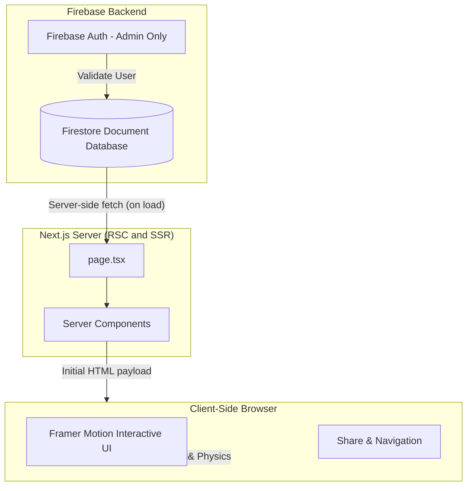

<div align="center">
  
  <h1 align="center">Next.js Firebase Link Tree</h1>
  <p align="center">
    <strong>A high-performance, dynamic link aggregator built for speed and aesthetics.</strong>
  </p>
  <p align="center">
    <a href="https://nextjs.org/"></a>
    <a href="https://firebase.google.com/"></a>
    <a href="https://tailwindcss.com/"></a>
    <a href="https://www.framer.com/motion/"></a>
  </p>
</div>

---

## 📖 Overview

This project serves as an ultra-fast, highly aesthetic alternative to Linktree. It leverages **Next.js 15 App Router** for React Server Components (RSC) capabilities, ensuring fast initial page loads, combined with **Firebase Firestore** for dynamic, zero-deployment link management.

The UI is deeply inspired by modern iOS glassmorphism and features physics-based micro-interactions powered by **Framer Motion**.

## 🏗 System Architecture

The architecture is designed to minimize client-side javascript while maintaining dynamic hydration capabilities.



## ✨ Key Technical Features

- **React Server Components**: Data fetching from Firestore happens entirely on the server via `page.tsx`, sending zero Firebase SDK JavaScript to the client by default.
- **Dynamic Fallbacks**: A robust fail-safe mechanism (`getLinks`) ensures that if Firebase quotas are exceeded or configuration is missing, the site gracefully falls back to local `USER_LINKS` without degrading the user experience.
- **Spring Physics Animations**: Complex, interruptible animations using `framer-motion` ensure interactions feel physical rather than strictly time-based.
- **Glassmorphism CSS Engine**: Extensive use of Tailwind v4's backdrop-filters, custom borders, and subtle radial gradients to achieve a premium depth effect.

## 📂 Project Structure

```text
link_tree/
├── public/                 # Static assets (images, meta icons)
├── src/
│   ├── app/                # Next.js 15 App Router endpoints
│   ├── components/         # Modular React components 
│   │   ├── LinkCard.tsx    # Animated list items parsing raw SVG
│   │   ├── ProfileHeader.tsx # Header & Avatar block
│   │   └── SocialRow.tsx   # Top row contact links
│   └── lib/                # Core logic
│       ├── firebase.ts     # Firebase initialization & queries
│       ├── links.ts        # Fallback raw data structure
│       └── utils.ts        # Tailwind merge & clsx utilities
├── .env.local              # Firebase Secrets (git ignored)
└── tailwind.config.ts      # Tailwind customizations
```

## 🚀 Quick Start Guide

### 1. Prerequisites
- Node.js 18+
- npm, yarn, or pnpm
- A Firebase Project (Firestore enabled)

### 2. Installation

Clone the repository and install dependencies:

```bash
git clone https://github.com/RajTewari01/link_tree.git
cd link_tree
npm install
```

### 3. Environment Configuration

Copy the example environment file and populate it with your Firebase config parameters:

```bash
cp .env.local.example .env.local
```

```env
# .env.local
NEXT_PUBLIC_FIREBASE_API_KEY="..."
NEXT_PUBLIC_FIREBASE_AUTH_DOMAIN="..."
NEXT_PUBLIC_FIREBASE_PROJECT_ID="..."
NEXT_PUBLIC_FIREBASE_STORAGE_BUCKET="..."
NEXT_PUBLIC_FIREBASE_MESSAGING_SENDER_ID="..."
NEXT_PUBLIC_FIREBASE_APP_ID="..."
```

### 4. Firestore Data Structure

To utilize dynamic loading, create a `links` collection in Firestore. Documents should follow this structure:

```typescript
interface TreeLink {
  title: string;
  subtitle?: string; // Optional
  url: string;
  iconUrl?: string;  // SVG String (Requires fill/stroke attributes)
  order: number;     // Integer for sorting
}
```

### 5. Running the Development Server

```bash
npm run dev
```

Navigate to `http://localhost:3000` to view the application.

## 🚢 Deployment Strategy

This repository is optimized for edge deployment on **Vercel**. 

1. Connect your GitHub repository to Vercel.
2. In the Vercel project settings, carefully add your Firebase environment variables.
3. Deploy. Because the app uses Next.js server components, database calls to Firestore will execute on Vercel's serverless functions during SSR/SSG.

## 📄 License
This architecture is distributed under the MIT License. See `LICENSE` for more information.
